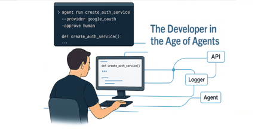

  

# 👋 Hi, I'm Tomer Kedem

I lead **Docs-as-System™** — a modern methodology that treats documentation as a living system,  
bridging humans, agents, and code inside the IDE.

I'm the author of the book series  
📘 *"The Developer in the Age of AI"*  
and a long-time software architect passionate about AI-driven engineering, documentation automation, and agent-assisted development.

---

## 🚀 Featured Projects

🔹 [Docs-as-System™](https://github.com/tomkedem/Docs-as-System)  
The official definition and manifesto of Docs-as-System™ — a framework for designing self-documented, AI-assisted development workflows.

🔹 [Humans & Machines](https://tomkedem.github.io/Docs-as-System/)  
A booklet exploring the relationship between developers and intelligent systems in modern engineering.

---

## 🧠 Areas of Focus

- AI-assisted software engineering  
- IDE-integrated agents and automation  
- LLM-based documentation and reasoning  
- .NET 8 backend architecture, SQL, Dapper, RabbitMQ  

---

## 🌐 Connect

🌍 [Docs-as-System Website](https://tomkedem.github.io/Docs-as-System/)  
💼 [LinkedIn Profile](https://www.linkedin.com/in/tomer-kedem/)  
📫 [Email Me](mailto:tompha1@hotmail.com)

---

© 2025 Tomer Kedem — part of the official **Docs-as-System™** methodology suite.
